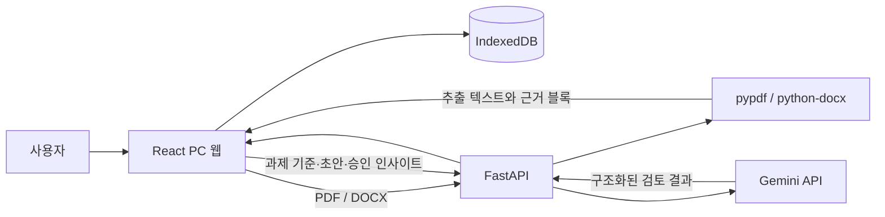

# Feedback Loop

> 흩어진 과제 기준과 교수님 피드백을 다음 제출물의 점검 루틴으로 연결하는
> 대학생용 PC 웹 서비스

Feedback Loop은 강의계획서, 과제·팀플 공지, 채점기준과 교수님 피드백을 한
과제 공간에서 역할별로 나누어 제출 초안을 검토한다. 점수나 교수님의 의도를 예측하는 대신,
사용자가 제공한 자료에서 확인할 수 있는 조건과 관련 문단을 근거로 보여준다.

과제가 쌓이면 반복된 피드백을 개인 인사이트 후보로 정리한다. 사용자가 직접
승인하거나 수정한 항목만 다음 과제의 점검 기준으로 재사용한다.

## 핵심 기능

- 과제별 강의계획서·과제 공지·팀플 공지·채점기준·피드백 관리
- PDF/DOCX 텍스트 추출과 페이지·문단 단위 근거 생성
- 필수 조건, 채점기준, 반복 피드백과 형식 조건을 반영한 초안 검토
- 검토 항목별 `통과`, `확인 필요`, `근거 없음` 상태와 출처 표시
- 교수님 피드백의 확인·반영·개선 상태 기록
- 두 개 이상의 서로 다른 피드백에서 발견된 인사이트 후보 생성
- 인사이트 승인·수정·숨김과 다음 과제 재사용
- 브라우저 IndexedDB 저장, JSON 백업·복구, 샘플 데이터
- Render Free 콜드스타트 사전 깨우기·재시도와 연결 상태 안내

## 사용 흐름

```text
과제 생성
  → 과제 기준 자료 등록
  → 제출 초안 업로드
  → 근거 기반 제출물 검토
  → 교수님 피드백과 반영 상태 기록
  → 반복 인사이트 승인·수정
  → 다음 과제 검토에 재사용
```

## 구조



- 프론트엔드는 과제·문서 추출 결과·검토 결과·피드백·인사이트를 브라우저에
  저장한다.
- 백엔드는 업로드 파일을 요청 중에만 읽고 영구 저장하지 않는다.
- Gemini에는 파일 자체가 아니라 추출된 텍스트와 근거 식별자가 전달된다.
- AI가 반환한 근거는 백엔드에서 실제 요청에 존재하는 `documentId`와
  `blockId`인지 다시 검증한다.

## 기술 스택

| 영역 | 기술 |
| --- | --- |
| Frontend | React 19, TypeScript, Vite, IndexedDB (`idb`) |
| Backend | FastAPI, Pydantic, Uvicorn |
| Document | `pypdf`, `python-docx` |
| AI | Gemini API 구조화 JSON 응답 |
| Test | Vitest, Testing Library, Pytest, Ruff, ESLint |
| Deploy | Vercel 정적 프론트, Render Web Service |

## 로컬 실행

검증 환경은 Node.js 24, npm 11, Python 3.11이다. Node.js 20.19 이상과
Python 3.11 이상을 권장한다.

### 1. 백엔드

프로젝트 루트에서 실행한다.

```powershell
python -m venv .venv
.\.venv\Scripts\python.exe -m pip install -r backend\requirements-dev.txt
Copy-Item backend\.env.example backend\.env
Set-Location backend
..\.venv\Scripts\python.exe -m uvicorn app.main:app --reload --port 8000
```

실제 AI 검토를 사용하려면 `backend/.env`의 `GEMINI_API_KEY`에 Google AI
Studio에서 발급한 키를 넣는다. 키가 없어도 `/health`, 문서 추출, 프론트 샘플
데이터는 사용할 수 있다.

### 2. 프론트엔드

새 PowerShell 터미널에서 실행한다.

```powershell
Set-Location frontend
npm install
Copy-Item .env.example .env
npm run dev
```

브라우저에서 `http://localhost:5173`을 연다. API 기본 주소는
`http://localhost:8000`이다.

## 환경변수

### Frontend

| 이름 | 기본값 | 설명 |
| --- | --- | --- |
| `VITE_API_BASE_URL` | `http://localhost:8000` | FastAPI 공개 주소 |

### Backend

| 이름 | 기본값 | 설명 |
| --- | --- | --- |
| `FRONTEND_ORIGIN` | `http://localhost:5173` | CORS를 허용할 프론트 주소 |
| `GEMINI_API_KEY` | 없음 | Gemini 서버 측 비밀 키 |
| `GEMINI_MODEL` | `gemini-3.5-flash-lite` | 검토에 사용할 모델 |
| `MAX_FILE_SIZE_MB` | `15` | 업로드 파일 한도 |
| `MAX_REVIEW_CHARACTERS` | `120000` | 한 번에 검토할 최대 문자 수 |
| `REQUESTS_PER_HOUR` | `10` | IP별 시간당 AI 요청 한도 |

실제 비밀값은 `.env` 또는 배포 서비스의 Secret에만 저장하고 Git에 커밋하지
않는다.

## API

| Method | Path | 역할 |
| --- | --- | --- |
| `GET` | `/health` | 서버·Gemini 설정 상태 확인 |
| `POST` | `/api/v1/documents/extract` | PDF/DOCX를 근거 블록으로 변환 |
| `POST` | `/api/v1/reviews` | 자료·초안·인사이트 기반 제출물 검토 |
| `POST` | `/api/v1/insights/candidates` | 반복 피드백 인사이트 후보 생성 |

FastAPI 실행 후 `http://localhost:8000/docs`에서 OpenAPI 문서를 확인할 수 있다.

## 검사

### Frontend

```powershell
Set-Location frontend
npm run typecheck
npm run lint
npm test
npm run build
```

### Backend

```powershell
Set-Location backend
..\.venv\Scripts\python.exe -m ruff check .
..\.venv\Scripts\python.exe -m pytest
```

## 배포

- 프론트엔드는 Vercel에서 `frontend/`를 Root Directory로 지정한다.
- 백엔드는 저장소 루트의 `render.yaml`을 Render Blueprint로 연결한다.
- Render에는 `GEMINI_API_KEY`와 실제 Vercel 주소인 `FRONTEND_ORIGIN`을 넣는다.
- Vercel에는 Render 주소를 `VITE_API_BASE_URL`로 넣고 다시 배포한다.

Render Free 백엔드는 15분 동안 실제 요청이 없으면 잠들 수 있다. 앱은 화면이
열릴 때 `/health`를 호출하고 일시적인 연결 실패를 재시도한다. 무료 제한을
우회하는 keep-alive 봇은 사용하지 않는다. 자세한 내용은
[`docs/deployment.md`](docs/deployment.md)를 참고한다.

## 데이터와 개인정보

- 사용자 데이터는 기본적으로 현재 브라우저의 IndexedDB에 저장된다.
- 브라우저 초기화나 기기 변경에 대비해 설정 화면에서 JSON 백업을 내려받는다.
- 업로드 전 주민등록번호, 연락처, 성적 등 불필요한 민감정보를 제거한다.
- 백엔드는 파일과 사용자 데이터를 영구 저장하지 않지만, AI 검토 시 추출된
  텍스트가 Gemini API로 전송된다.
- 후보 또는 숨김 상태의 인사이트는 다음 검토에 자동 사용하지 않는다.

## 제품 경계

현재 MVP에는 다음 기능을 포함하지 않는다.

- 학교 LMS 자동 로그인 또는 무단 크롤링
- 실제 점수·등급 예측
- 교수님의 의도·성향 추정
- 팀원의 성실도·인성 자동 판정
- 교수자용 학급 분석 대시보드
- 스캔 이미지 PDF OCR
- 서버 계정·기기 간 데이터 동기화

## 저장소 구조

```text
feedback-loop/
├─ frontend/                 # React PC 웹, IndexedDB, UI 테스트
├─ backend/                  # FastAPI, 문서 추출, Gemini 연동, API 테스트
├─ docs/
│  ├─ product/               # 제품 범위와 사용자 흐름
│  ├─ domain/                # 용어와 도메인 모델
│  ├─ decisions/             # 아키텍처·개인정보 결정 기록
│  ├─ conventions/           # 코딩·Git 규칙
│  └─ deployment.md          # Vercel·Render 배포 순서
├─ scripts/                  # 개발 보조 스크립트
├─ render.yaml               # Render Blueprint
└─ README.md
```

## 개발 문서

- [제품 기획](docs/product/feedback-loop.md)
- [도메인 용어](docs/domain/glossary.md)
- [코딩 규칙](docs/conventions/coding.md)
- [Git·GitHub 워크플로](docs/conventions/git-workflow.md)
- [아키텍처 결정](docs/decisions/README.md)
- [배포 가이드](docs/deployment.md)

## Git·GitHub 워크플로

1. 이슈에 문제·범위·완료 조건을 기록한다.
2. `feature/`, `fix/`, `docs/`, `chore/` 브랜치에서 작업한다.
3. 원상복구 가능한 논리 단위로 커밋한다.
4. 검사를 통과한 뒤 PR에서 변경사항을 검토하고 `main`에 병합한다.
